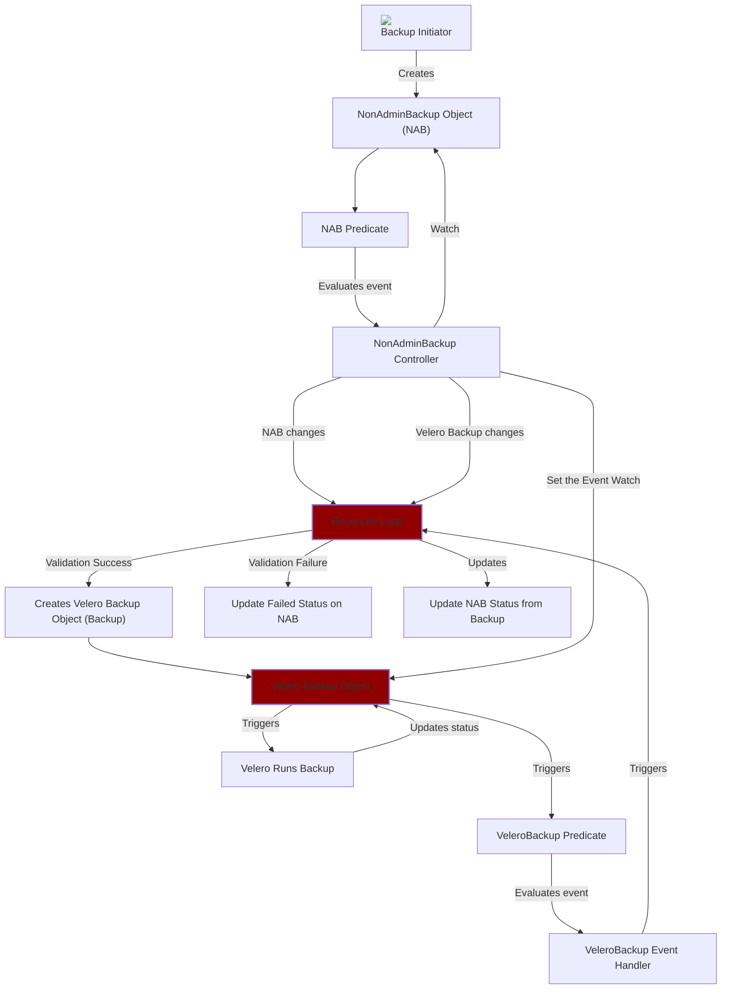

# User Workflow: Managing NonAdminBackup with Velero

## Overview

This document outlines the workflow for managing NonAdminBackup objects with Velero, a backup and restore tool for Kubernetes clusters.

### Prerequisites:

1. **OADP installed**: OADP must be installed and configured to use non-admin controller

2. **Non Admin Controller configured**: Data Protection Application (DPA) instance must configure Non Admin Controller to watch user namespace(s), by default it watches all Namespaces

3. **RBAC priviledges for the user**: User must have the appropriate RBAC priviledges to create Non Admin Backup object within the Namespace where Backup will be taken. An example of such ClusterRole, which may be added to the user with `RoleBinding`:

    ```yaml
    # permissions for end users to edit nonadminbackups.
    apiVersion: rbac.authorization.k8s.io/v1
    kind: ClusterRole
    metadata:
    labels:
        app.kubernetes.io/name: clusterrole
        app.kubernetes.io/instance: nonadminbackup-editor-role
        app.kubernetes.io/component: rbac
        app.kubernetes.io/created-by: oadp-nac
        app.kubernetes.io/part-of: oadp-nac
        app.kubernetes.io/managed-by: kustomize
    name: nonadminbackup-editor-role
    rules:
    - apiGroups:
        - nac.oadp.openshift.io
      resources:
        - nonadminbackups
      verbs:
        - create
        - delete
        - get
        - list
        - patch
        - update
        - watch
    - apiGroups:
        - nac.oadp.openshift.io
      resources:
        - nonadminbackups/status
      verbs:
        - get

    ```


### Workflow Steps:

1. **User creates or updates the NonAdminBackup object**: The user creates or updates a NonAdminBackup custom resource object in the Namespace on which the backup will run within the Kubernetes cluster. The `NonAdminBackup` schema has the `backupSpec`, which is the same as `Backup` CR from the `velero.io/v1` apiVersion.

    ```yaml
    apiVersion: nac.oadp.openshift.io/v1alpha1
    kind: NonAdminBackup
    metadata:
      name: example
      namespace: user-namespace
    spec:
      backupSpec: {}
    ```

2. **NonAdminBackup controller Reconciles**: The NonAdminBackup controller continuously reconciles the NonAdminBackup object's desired state with the actual state in the cluster.

3. **Reconcile creates or updates Velero Backup object**: When the NonAdminBackup controller detects a new or modified NonAdminBackup object, it creates or updates a corresponding Velero Backup object within the OADP Namespace using the information provided in the `backupSpec` field of the NonAdminBackup object. The resulting Backup object is named as `nab-<namespace>-<hash>`, where the `<namespace>` is the NonAdminBackup namespace and the `<hash>` is computed from the original NonAdminBackup name. The resulting Backup object is labeled and annotated with the following additional metadata:

    ```yaml
    metadata:
      annotations:
        openshift.io/oadp-nab-origin-name: <NonAdminBackup name>
        openshift.io/oadp-nab-origin-namespace: <NonAdminBackup Namespace>
        openshift.io/oadp-nab-origin-uuid: <NonAdminBackup UUID>
      labels:
        app.kubernetes.io/managed-by: <OADP NonAdminController id>
        openshift.io/oadp: 'True'
    ```

4. **Velero runs Backup**: Velero executes the backup operation based on the configuration specified in the Velero Backup object. Velero updates the status of the Velero Backup object to reflect the outcome of the backup process.

5. **NonAdminBackup controller watches Velero Backup objects**: The NonAdminBackup controller also watches Velero Backup objects for changes, like the changes in their status.

6. **Reconcile loop updates NonAdminBackup object Status**: Upon detecting changes in the status of the Velero Backup object, the NonAdminBackup controller's reconciliation loop updates the Status field of the corresponding NonAdminBackup object with the updated status from the Velero Backup object.

### Conclusion:

This workflow provides a seamless way for users to manage backups of their Kubernetes resources using the NonAdminBackup custom resource, with Velero handling the backup and restore operations in the background.

---



